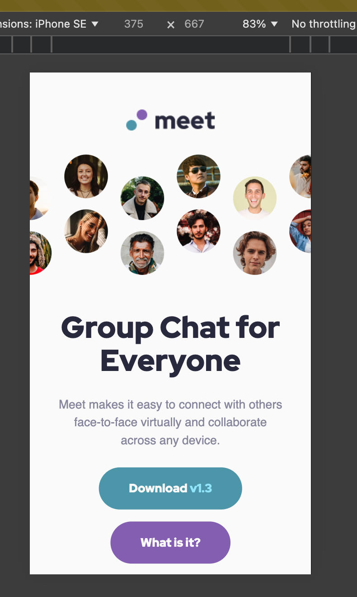

# Frontend Mentor - Meet landing page solution

This is a solution to the [Meet landing page challenge on Frontend Mentor](https://www.frontendmentor.io/challenges/meet-landing-page-rbTDS6OUR). Frontend Mentor challenges help you improve your coding skills by building realistic projects.

## Table of contents

- [Overview](#overview)
  - [The challenge](#the-challenge)
  - [Screenshot](#screenshot)
  - [Links](#links)
- [My process](#my-process)
  - [Built with](#built-with)
  - [What I learned](#what-i-learned)
  - [Continued development](#continued-development)
  - [Useful resources](#useful-resources)
- [Author](#author)
- [Project setup](#project-setup)

**Note: Delete this note and update the table of contents based on what sections you keep.**

## Overview

### The challenge

Users should be able to:

- View the optimal layout depending on their device's screen size
- See hover states for interactive elements

### Screenshot

#### Desktop screenshot


#### Mobile screenshot



### Links

- Solution URL: [here](https://www.frontendmentor.io/challenges/meet-landing-page-rbTDS6OUR/)
- Live Site URL: [here](https://jameslaviron.github.io/meet-landing-page/)

## My process

### Built with

- Semantic HTML5 markup
- CSS custom properties
- Flexbox
- CSS Grid
- Mobile-first workflow
- BEM methodology
- Github Copilot
- [Vue](https://vuejs.org/) - JS library

### What I learned

I learned how to use `@use` instead of `@import` in order to optimize loaded css. If you got feedbacks on that subject, I would be more than happy.

I also learned how to use mixin functions in order to avoid code duplicates for desktop/tablet

```css
@mixin responsive($devices...) {
  @each $device in $devices {
    @if $device == "desktop" {
      @include desktop {
        @content;
      }
    } @else if $device == "tablet" {
      @include tablet {
        @content;
      }
    } @else if $device == "mobile" {
      @include mobile {
        @content;
      }
    }
  }
}
```

### Continued development

I would like to focus on improving semantic html and sass related skills

### Useful resources

- [Grid cheat sheet](https://grid.malven.co/) - This helped me to keep track of grid properties.
- [BEM cheat sheet](https://bem-cheat-sheet.9elements.com/) - This helped me to understand BEM methodology.

### Author

- Frontend Mentor - [@JamesLaviron](https://www.frontendmentor.io/profile/JamesLaviron)

### Project setup

```sh
yarn install
```

#### Compiles and hot-reloads for development

```sh
yarn serve
```

#### Compiles and minifies for production

```sh
yarn build
```

#### Lints and fixes files

```sh
yarn lint
```

#### Customize configuration

See [Configuration Reference](https://cli.vuejs.org/config/).
